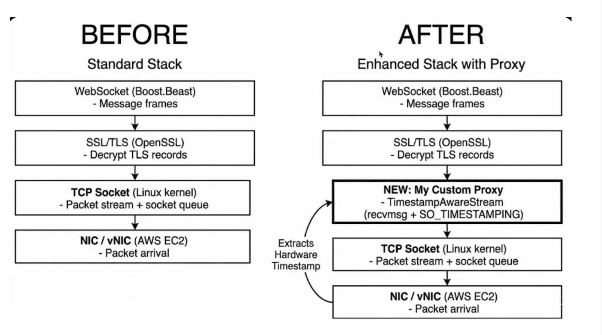

# Low-Latency Market Data Capture with Hardware-Level Timestamping on AWS



---

## Why

**In HFT, the timestamp on your market data is your ground truth. If it's wrong, everything downstream is wrong.**

Every standard WebSocket market data implementation timestamps the message *after* TLS decryption and WebSocket framing — introducing 50–500µs of jitter driven by scheduler preemption and decode overhead. This jitter is not just large. It's **unknowable and uncorrectable**.

The consequences are real:

- **Cross-venue arbitrage** — If you're trading the lead-lag between Bybit perpetuals and Binance spot, 100µs of timestamp noise is 20% of your total signal window. You cannot reliably determine which venue moved first.
- **Market making** — Quote staleness detection requires knowing exactly when an adverse price move arrived. Application-layer timestamps can't distinguish "the price moved before my order" from "the price moved after" when the jitter exceeds the signal.
- **TCA / execution quality** — If your reference price is timestamped 180µs late, your fill analysis systematically understates adverse selection. You scale the wrong strategies.

The only fix is to capture the timestamp **before** any application-layer processing — at the kernel or NIC level, the moment the packet arrives.

---

## How

Insert a custom `TimestampAwareStream` proxy **below TLS**, at the raw TCP socket layer. It intercepts every `read_some()` call with `recvmsg()`, extracting the kernel-attached `SO_TIMESTAMPING` ancillary data.

```
Standard path (wrong):
  NIC arrival (T0) → TCP → TLS decrypt → WS frame → app timestamps here (T4)
  Error = T4 - T0 = 50–500µs, unknown, uncorrectable.

This project:
  NIC arrival → kernel stamps T0 here
                              ↓
  TCP → [TimestampAwareStream reads T0 via recvmsg()] → TLS → WS → app (T4)
  Now: T4 - T0 = measured stack latency. T0 - exchange_ts = observed network latency.
```

**Why this works:** `SO_TIMESTAMPING` with `SOF_TIMESTAMPING_RX_HARDWARE` instructs the NIC (or kernel, as fallback) to latch a timestamp the moment a packet is received — before the softirq fires, before any CPU processes the data. `recvmsg()` retrieves this pre-recorded value via the CMSG ancillary data interface. The timestamp is not taken when `recvmsg()` runs — it was already captured earlier at the hardware layer.

**What most engineers miss:** The standard `clock_gettime()` after `ws.read()` embeds TLS decrypt time + WebSocket reassembly time + scheduler wake-up delay. On a loaded EC2 instance, this jitter regularly hits 200–500µs. On bare metal co-lo with a Solarflare NIC, `SO_TIMESTAMPING` gets you to sub-microsecond precision. This project implements the same pattern — transparently, without modifying any upstream library code.

---

## What

A C++17 market data capture system for Bybit's v5 WebSocket feed that:

1. **Stamps every packet at the kernel/NIC layer** via `TimestampAwareStream` — a custom Boost.Beast `SyncReadStream` template that wraps `recvmsg()` + `SO_TIMESTAMPING`, injected transparently between TCP and TLS.

2. **Selects the most accurate available clock** via a pluggable `TimeSource` abstraction — PTP hardware clock (`/dev/ptp_ena` on AWS Nitro, ~100ns accuracy) with automatic fallback to `std::chrono::system_clock`.

3. **Produces per-event latency records** — every orderbook update and trade carries `arrival_ts` (T0, kernel RX) and `app_ts` (T4), enabling:
   - `T4 − T0` = internal stack processing latency
   - `T0 − exchange_ts` = observed network latency (relative; requires clock sync for absolute accuracy)

---

## Architecture

### Before: Standard Stack

```
[ WebSocket (Boost.Beast) ]   ← T_app: message timestamped here
         ↑
[ SSL/TLS (OpenSSL)       ]   ← variable decode time (1–10µs)
         ↑
[ TCP Socket              ]   ← scheduler wake-up jitter (10–500µs on EC2)
         ↑
[ NIC / vNIC (AWS EC2)    ]   ← T0: actual packet arrival — LOST
```

### After: Enhanced Stack with Proxy

```
[ WebSocket (Boost.Beast) ]   ← T4: application receive time
         ↑
[ SSL/TLS (OpenSSL)       ]
         ↑
[ TimestampAwareStream    ]   ← recvmsg() reads T0 from kernel CMSG
         ↑                       (T0 was already stamped at NIC arrival)
[ TCP Socket              ]
         ↑
[ NIC / vNIC (AWS EC2)    ]   ← T0: stamped here by HW (or kernel softirq)
```

**On AWS EC2:** Most ENA instances provide kernel software timestamps (`ts[0]`). AWS `c6in`/`m6in`/`r6in` with Nitro provide `SOF_TIMESTAMPING_RX_HARDWARE` (`ts[2]`). The proxy requests hardware first, silently falls back to software — `ts[2].tv_sec == 0` is the reliable runtime detector, not `setsockopt` return value.

---

## Use Cases

| Strategy | Why T0 matters |
|---|---|
| **Cross-venue stat arb** (Bybit perp ↔ Binance spot) | Lead-lag signal lives at sub-500µs. Application timestamps bury the signal in noise. |
| **Market making / adverse selection** | Distinguish whether a price move arrived before or after your quote. Quote staleness detection requires kernel-precision arrival time. |
| **TCA / execution quality** | Reference price at the moment of signal trigger. 180µs late = wrong fill classification = wrong strategy sizing. |
| **Exchange latency monitoring** | `T0 − exchange_ts` spikes indicate Bybit-side congestion before it affects fill rates. Pull back market making proactively. |
| **Co-location benchmarking** | Measure actual wire-to-strategy latency across EC2 regions/instance types to optimize deployment. |

---

## Repository Structure

```
├── ProxyTemplate/
│   ├── TimestampAwareStream.hpp     # Core: SO_TIMESTAMPING proxy (Boost.Beast SyncReadStream)
│   └── Guideline for using proxy.txt
│
├── TCP test/
│   ├── TcpClient.cpp                # Validates SO_TIMESTAMPING extraction independently
│   └── TcpReceiver.cpp              # Shows ts[0]/ts[1]/ts[2] on raw TCP — no WS overhead
│
├── TimeSource.h                     # Interface: now_ns() → nanoseconds since epoch
├── PtpTimeSource.h / .cpp           # PTP clock: /dev/ptp_ena (AWS Nitro PHC, ~100ns)
├── SystemClockTimeSource.h / .cpp   # Fallback: std::chrono::system_clock
├── TimeSourceFactory.h / .cpp       # Runtime: picks best available clock
│
├── RawFileLogger.h / .cpp           # Buffered logger (flush every N lines)
└── bybit_orderbook.cpp              # Bybit v5 WebSocket client (Boost.Beast + OpenSSL)
```

---

## Key Technical Detail: `TimestampAwareStream`

Implements Boost.Beast's `NextLayer` / `SyncReadStream` concept. Drop-in between raw socket and `beast::ssl_stream` — zero changes to TLS or WebSocket layers.

```cpp
tcp::socket                          raw_socket(ioc);
TimestampAwareStream<tcp::socket>    ts_proxy(raw_socket);  // proxy injected here
beast::ssl_stream<TimestampAwareStream<tcp::socket>&> ssl(ts_proxy, ctx);
ws::stream<...>                      ws_stream(ssl);

ws_stream.read(buffer);
long long t0_ns = ws_stream.next_layer().next_layer().get_last_ts_ns();
long long t4_ns = time_source->now_ns();
// latency_ns = t4_ns - t0_ns
```

**Fallback logic:** Constructor sets `SO_TIMESTAMPING` flags and requests hardware. Runtime: if `ts[2].tv_sec == 0` after first read, hardware is not available on this NIC → use `ts[0]` (kernel software). `setsockopt` returning 0 is not a reliable indicator of hardware support.

**Current state:** Proxy is implemented and validated on raw TCP (see `TCP test/`). Integration into the async Boost.Beast WebSocket client is in progress — the synchronous read path is complete; async `read_some` wrapper is the remaining step.

---

## Technology Stack

| Layer | Technology |
|---|---|
| Language | C++17 |
| WebSocket / Async I/O | Boost.Beast / Boost.Asio |
| TLS | OpenSSL (TLS 1.3, SNI) |
| Packet Timestamping | `SO_TIMESTAMPING` + `recvmsg()` — `SOF_TIMESTAMPING_RX_HARDWARE` / `_RX_SOFTWARE` |
| Hardware Clock | PTP `/dev/ptp_ena` (AWS Nitro PHC) |
| Infrastructure | AWS EC2 ENA — Nitro `c6in`/`m6in` for HW timestamps |
| Data Source | Bybit v5 WebSocket API (`orderbook.1/50.BTCUSDT`, tick stream) |
| Storage | NoSQL (per-event: `arrival_ts`, `app_ts`, `exchange_ts`) |

---

## Skills Demonstrated

| Skill | Where |
|---|---|
| Linux kernel networking | `SO_TIMESTAMPING`, `recvmsg()`, CMSG parsing, `ts[0]/ts[2]` layout |
| C++ template design | `TimestampAwareStream<NextLayer>` — generic Boost.Beast stream concept |
| HFT infrastructure | Kernel-to-application timestamp propagation through layered I/O stack |
| AWS systems | ENA enhanced networking, Nitro PHC (`/dev/ptp_ena`), instance-type timestamp capability |
| Software architecture | Strategy pattern (TimeSource), factory, layered stream composition |

---

## Build

**Linux / AWS EC2**
```bash
g++ -std=c++17 bybit_orderbook.cpp \
  -lboost_system -lssl -lcrypto -lpthread -O2 -o bybit_ws
```

**macOS (dev)**
```bash
clang++ -std=c++17 bybit_orderbook.cpp \
  -I/opt/homebrew/include \
  -I/opt/homebrew/opt/openssl@3/include \
  -L/opt/homebrew/opt/openssl@3/lib \
  -lssl -lcrypto -lpthread -O2 -o bybit_ws
```

---

## Status

| | Item |
|---|---|
| ✅ | Bybit v5 WebSocket client (SSL + Boost.Beast) |
| ✅ | `TimestampAwareStream` — `SO_TIMESTAMPING` proxy, HW→SW fallback |
| ✅ | `TimeSource` — PTP + SystemClock with factory |
| ✅ | `RawFileLogger` — buffered file writer |
| ✅ | TCP test harness — validates `ts[0]/ts[2]` extraction on raw socket |
| 🔄 | Wire proxy into async WebSocket client (`async_read_some` wrapper) |
| ⬜ | Orderbook model (L1/L50 snapshot + delta) |
| ⬜ | Orderbook / tick handlers with `arrival_ts` |
| ⬜ | NoSQL flush pipeline |

*Designed and implemented independently as part of IE421 High Frequency Trading, UIUC.*
